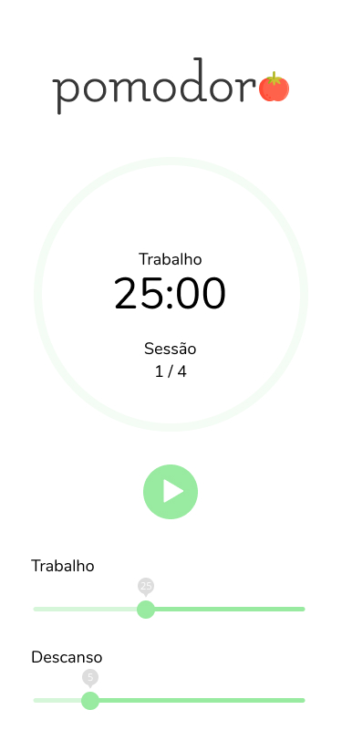
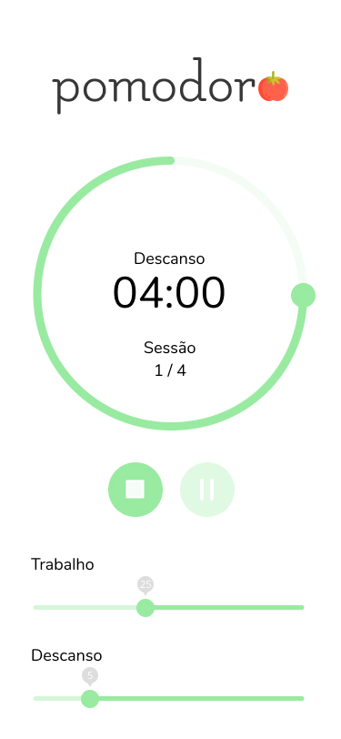
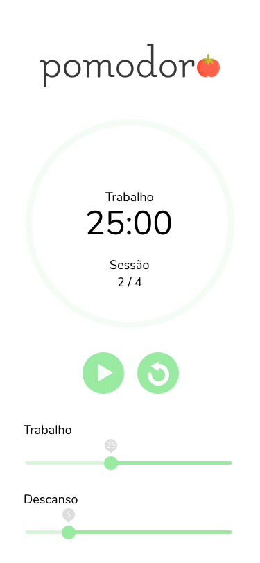

<!-- Logo -->

  

<!-- Badges -->

  
  
  

<!-- Description -->

<h4 align="center">
	🚀 Aplicação que te permite desfrutar do pomodoro! 💥
</h4>

<!-- Project Design -->

  
  
  
  

<!-- Summary -->

<h2>Índice</h2>

- [:bookmark: Sobre](#bookmark-sobre)
- [:framed_picture: Layout](#framed_picture-layout)
- [:computer: Demo](#computer-demo)
- [:rocket: Tecnologias](#rocket-tecnologias)
- [:book: O que aprendi](#book-o-que-aprendi)
- [:recycle: Como contribuir](#recycle-como-contribuir)
- [:memo: Licença](#memo-licença)

## :bookmark: Sobre

A Técnica Pomodoro é um método de gerenciamento de tempo desenvolvido por Francesco Cirillo no final dos anos 1980.

A técnica usa um cronômetro para dividir o trabalho em intervalos, tradicionalmente de 25 minutos de duração, separados por intervalos curtos - 5 minutos.

Nesta aplicação, além de cronometrar as suas sessões de trabalho/descanso, pode-se personalizar quanto tempo haverá em tais sessões.

## :framed_picture: Layout

O layout desta aplicação está disponível no [Figma](https://www.figma.com/file/7u1JrbxEDbY72ZF6bYsX9N/Pomodoro-App?node-id=0%3A1).

## :computer: Demo

Essa aplicação foi hospedada pelo [Netlify](https://www.netlify.com/) e pode ser encontrada aqui: [Pomodoro](https://pomodoro-iguzinho.netlify.app/).

## :rocket: Tecnologias

Essa aplicação se utiliza das seguintes tecnologias:

-  [TypeScript](https://www.typescriptlang.org/)
-  [ReactJS](https://reactjs.org/)
-  [ESLint](https://eslint.org/) (Padronização de código)
-  [Prettier](https://prettier.io/) (Formatação de código)
-  [Sass](https://sass-lang.com/) (Pré-processador CSS)
-  [React Sound](https://github.com/leoasis/react-sound) (Reprodução de áudios)

## :book: O que aprendi

## :recycle: Como contribuir

- Crie um fork desse repositório,
- Crie uma branch com o nome da sua feature: `git checkout -b my-feature`
- Faça um commit das suas alterações: `git commit -m 'feat: My new feature'`
- Faça um push da sua branch: `git push origin my-feature`

## :memo: Licença

Esse projeto está sob a licença MIT. Veja o arquivo [LICENSE](LICENSE) para mais detalhes.

---

  Feito com ❤️ por <a href="https://github.com/igooralm192" target="_blank">Igor Almeida</a>!!

